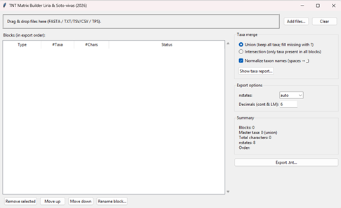
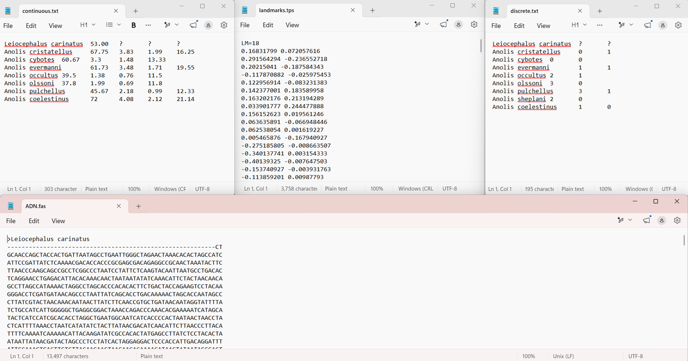
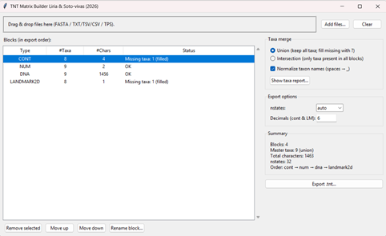
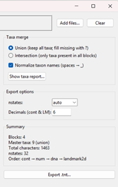
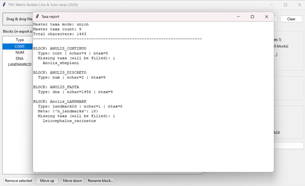

# TNT Matrix Builder: A Python GUI for combined and Multi-Data phylogenetic matrices

<div align="left">
  

**Developed by: Jonathan Liria**

**Neotropical Cladistic Biogeography Computing Lab (NCBC-Lab)**  
An academic initiative focused on developing high-performance computational tools for complex spatial analysis, biogeography, and systematic biology in the Neotropics.

 
  [](https://www.python.org/)
  [](https://opensource.org/licenses/MIT)
</div>

---

## Introduction

`TNT Matrix Builder` is a graphical application developed in Python specifically designed to facilitate the teaching and learning of the TNT software in Phylogenetic Systematics and Cladistics courses. The program addresses one of the greatest challenges for students and researchers: the integration of "total evidence" (molecular data, discrete morphological data, and continuous characters) into a single analysis file. 

While packages like Mesquite (Maddison & Maddison, 2025) are excellent for the visual editing of multiple matrices, they lack a combined export function that automates the syntax required by TNT. This forces the user to resort to manual text editing, a process involving the precise configuration of commands like `nstates`, `xread`, and block tags (`&[dna]`, `&[num]`, `&[cont]`), which are frequently sources of errors during practical exercises.

This tool complements and expands the workflow of previous applications such as `py_tm2tnt` and `py_tps2tnt` (Liria & Soto-Vivas, 2025), allowing students or researchers who are new to TNT to perform phylogenetic analyses incorporating an integrative approach. By automating the concatenation of multiple data blocks, `TNT Matrix Builder` eliminates potential errors in the manipulation of the `.tnt` file, allowing the user to focus strictly on the phylogenetic analysis as such. 

The program not only automatically synchronizes taxon names using union and intersection protocols, but also manages the complexity of 2D geometric morphometric data (TPS files), averaging specimens per taxon and integrating measurement scales according to the guidelines of Catalano & Goloboff (2018). This tool is therefore presented as an essential technological bridge that simplifies the transition from heterogeneous data collection to its processing in the TNT phylogenetic search engine (Goloboff & Morales, 2023).

---

## User Interface Overview

<div align="center">
  <!-- Replace with actual path to image if hosted locally -->
  
  <p><em>Figure 1. General overview of the TNT Matrix Builder interface showing the "Blocks" area and the lateral configuration panel.</em></p>
</div>

---

## 1. Requirements

Before using `TNT Matrix Builder`, ensure you have installed:
* **Python 3.x**
* **Standard libraries:** `tkinter`, `re`, `math`, `os`, `dataclasses`.
* **Optional library:** `tkinterdnd2` (to enable the drag-and-drop file feature). You can install it using the command: `pip install tkinterdnd2`.

*Note: There is an executable version available that can be downloaded from the following link: [[TNT_Matrix_Builder.exe](https://www.dropbox.com/scl/fi/3wakmta1x73lc7l7lo23t/TNT_matrix_builder.exe?rlkey=x1bz24c0dh8mnptkque79orfc&st=p9ge06vl&dl=0)]*.

---

### Repository Structure

The project directory is structured as follows:

```text
csv2xyd/
│
├── Images/                 # GUI screenshots, system diagrams, and graphical assets
├── TNT_matrix_builder.py   # Core module containing parsing engines and algorithms
├── Manual/                 # Detailed step-by-step user and technical manual (in Spanish)
├── Test/                   # Sample data files
├── README.md               # Main project documentation and quick-start guide
└── LICENSE                 # MIT License details
```

---


## 2. Supported Formats

The program automatically detects the nature of the data based on its content:
* **Molecular (DNA):** FASTA files (`.fasta`, `.fa`, `.fas`).
* **Tables (`.txt`, `.tsv`, `.csv`):**
  * **Discrete/Numeric:** If the file contains integers or polymorphisms.
  * **Continuous:** Automatically detected by the presence of decimal values.
* **Landmarks (TPS):** `.tps` files with 2D landmarks. The program automatically averages the specimens per species.

<div align="center">
  
  <p><em>Figure 2. Example of the various supported data types: FASTA sequences, continuous/discrete data tables, and morphometric TPS files.</em></p>
</div>

---

## 3. Step-by-Step Guide

### Step 1: Loading files
Add your matrices using the **"Add files..."** button or by dragging the files directly onto the top panel of the interface. The blocks will appear listed showing their automatically detected data type.

### Step 2: Organization and priority rule
This option allows organizing the order of the blocks in TNT; for example, if it is desired that molecular characters (COI, 16s, etc.) be at the end, and others (continuous, discrete) at the beginning. If the project includes continuous characters or Landmarks, **these must always be placed in the first position of the list (Block 1)**. 

Utilize the **"Move up"** and **"Move down"** buttons to adjust the sorting order. You can use **"Rename block..."** to assign descriptive names for each block, which will then appear in the `cname` section of the final file.

<div align="center">
  
  <p><em>Figure 3. Detail of the block list indicating the use of movement buttons to position continuous data at the beginning.</em></p>
</div>

### Step 3: Taxa concatenation (Taxa Merge)
* **Union:** Keeps all taxon names and fills missing blocks with empty/missing data (`?`).
* **Intersection:** Only retains the taxa that are present across all loaded files.
* **Normalize names:** Replaces spaces with underscores (`_`) for terminal names where Genus and species are assigned, which is a strict requirement in TNT and a common source of formatting errors.

<div align="center">
  
  <p><em>Figure 4. Option panel for "Taxa merge" with the Union/Intersection functions and species name normalization.</em></p>
</div>

### Step 4: Exporting the matrix to TNT
Select the range of states in **"nstates"** (the program will automatically choose `32` if continuous data is detected). If the concatenated matrices only contain molecular data, it is highly recommended to choose `nstates 8` to optimize engine memory usage. Finally, click on **"Export .tnt..."** to obtain your ready-to-run concatenated file.

---

## 4. Concatenation report

Before exporting, it is highly recommended to check the **"Show taxa report..."** button. This function allows you to validate the structural integrity of the matrix, showing which species are absent in each individual block and confirming the total number of characters that will make up the final analysis.

<div align="center">
  
  <p><em>Figure 5. Taxa report window ("Taxa report") showing the list of absent species for each loaded source file.</em></p>
</div>

---

## 5. References

* Catalano, S., Goloboff, P.A. (2018). *A guide for the analysis of continuous and landmark characters in TNT*.
* Goloboff, P.A., Morales, M.E. (2023). *TNT version 1.6, with a graphical interface for MacOS and Linux, including new routines in parallel.* Cladistics, 39: 144-153.
* Liria, J., Soto-Vivas, A. (2025). *py_tps2tnt y py_tm2tnt: dos programas en Python para procesamiento de datos morfométricos en análisis cladísticos con TNT.* Revista Peruana de Biología, 32(2), e30018.
* Maddison, W. P., D.R. Maddison. (2025). *Mesquite: a modular system for evolutionary analysis.* Version 4.02. https://www.mesquiteproject.org.

---

## License

This project is licensed under the MIT License - see the local repository files for details.
